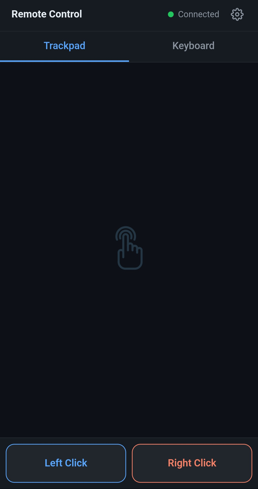
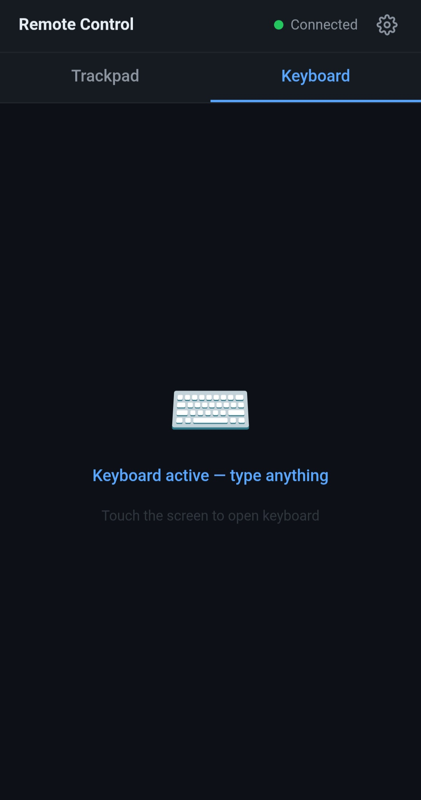

# Remote Control

Use your Android phone as a wireless trackpad and keyboard for your Mac via local WiFi network.

## Screenshots

<p align="center">
  
  &nbsp;&nbsp;
  
</p>

## Features

- **Trackpad** — move the cursor with single-finger swipe, scroll with two fingers
- **Tap gestures** — single tap to left-click, double-tap to double-click
- **Click & drag** — hold the Left Click button and swipe to drag
- **Keyboard** — type from your phone
- **Settings** — adjustable cursor speed and scroll speed

## Requirements

- **macOS** (uses CoreGraphics for mouse control)
- **Python 3.10+**
- Phone and Mac on the **same WiFi network**

## Setup

```bash
git clone https://github.com/elmooe/remote-control.git
cd remote-control-from-phone
./setup.sh
```

This creates a virtual environment and installs all dependencies.

## Usage

1. Start the server:

   ```bash
   ./run.sh
   ```

2. Open the URL shown in the terminal (e.g. `http://192.168.x.x:5001`) on your phone's browser.

3. Use the trackpad tab to move the cursor, or switch to the keyboard tab to type.

> **Tip:** On your phone, tap "Add to Home Screen" in the browser menu to add a shortcut to app.

## Permissions

On first run, macOS will ask for **Accessibility** permission (System Settings → Privacy & Security → Accessibility). Grant it to your terminal app or Python — this is required for mouse and keyboard control.
